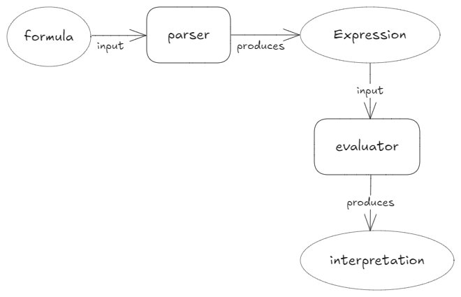

# QML Expression

An implementation of Abstract Syntax Trees for formulas of Quantified Modal Logic.

This library has been developed as part of my work as a Researcher at [IIF/SADAF/CONICET](https://iif.conicet.gov.ar/?lan=en) and as member of the [Talk Group](https://talk-group.org/).

## Description

This library is designed to work as an interface between parser libraries and semantic evaluation libraries. The general description of this intended architecture is:



## Installation

In order to build and install the library, navigate to the QMLExpression project root folder, and do the following:
```bash
mkdir build
cd build
cmake .. -DCMAKE_BUILD_TYPE=Relase
cmake --build .
```
You can use `-DCMAKE_BUILD_TYPE=Debug` for a debug build.

To install the QMLExpression as a system library:
```bash
cmake --install .
```
If you want to install it to a different location (non-system library), then specify the desired path:
```bash
cmake --install . --prefix /path/to/library_dir
```

## Usage in other projects

To use the library in another project, you need to add the following line to the `CMakeLists.txt` of the project using the library:

```cmake
find_package(QMLExpression REQUIRED)
```
If you have installed the QMLExpression library in a non-standard path, you will need to tell CMake, either through the command line:
```bash
cmake [directory with the project\'s CMakeLists.txt] -DCMAKE_PREFIX_PATH=/path/to/QMLExpression
```
or by adding the corresponding key-value pair to the `cacheVariables` section of CMakePresets.json:
```json
{
	...
	"cacheVariables" : {
		...
		"CMAKE_PREFIX_PATH": "/path/to/QMLExpression"
		...
	}
	...
}
```
Then, you need to add the library includes to the include directories:
```cmake
target_include_directories(target_name PUBLIC
    QMLExpression::QMLExpression
    # other include directories
)
```
Finally, link the library:
```cmake
target_link_libraries(target PUBLIC
    QMLExpression::QMLExpression
    # other libraries
)
```

### Expression

An `Expression` object is a `std::variant` with any of the following possible values:

- a `std::shared_ptr` to a `UnaryNode`
- a `std::shared_ptr` to a `BinaryNode`
- a `std::shared_ptr` to a `QuantificationNode`
- a `std::shared_ptr` to an `IdentityNode`
- a `std::shared_ptr` to a `PredicationNode`

You can check the declarations [here](include/expression.hpp). There you will find as well a `Term` class for the singular terms of the language, which may be of type `Term::Type::VARIABLE` or `Term::Type::CONSTANT`.

A few examples:
```c++
// constructing Term objects for use in building ASTs

const Term x("x", istk::qml::Term::Type::VARIABLE);
const Term y("y", istk::qml::Term::Type::VARIABLE);
const Term a("a", istk::qml::Term::Type::CONSTANT);
```

```c++
// constructing the variants

const auto predication1 = std::make_shared<PredicationNode>(
	"F",
	std::vector<istk::qml::Term>{x}
);

const auto predication2 = std::make_shared<PredicationNode>(
	"G",
	std::vector<istk::qml::Term>{x, a}
);

const auto disjunction = std::make_shared<BinaryNode>(
	istk::qml::Operator::DISJUNCTION,
	predication1,
	predication2
);

const auto negation = std::make_shared<UnaryNode>(
	istk::qml::Operator::NEGATION,
	disjunction
);

const auto universal = std::make_shared<QuantificationNode>(
	istk::qml::Quantifier::UNIVERSAL,
	x,
	predication1
);
```

```c++
// turning the variants into Expression objects

const Expression negation_expr(negation);
const Expression universal_expr(negation);
```

### Formatter

A formatter visitor for `Expression` objects is provided as well, with the purpose of being a quick way of rendering any `Expression` object as a QML formula. This visitor can be accessed directly:
```c++
const std::string formula = std::visit(istk::QML::Formatter(), expr);
```
It can also be accessed through the `format()` convenience function:
```c++
const std::string formula = istk::QML::formt(expr);
```

## Contributing

Contributions are more than welcome. If you want to contribute, please do the following:

1. Fork the repository.
2. Create a new branch: `git checkout -b feature-name`.
3. Make your changes.
4. Push your branch: `git push origin feature-name`.
5. Create a pull request.

## License
This project is licensed under the [BSD-3-Clause](LICENSE).
